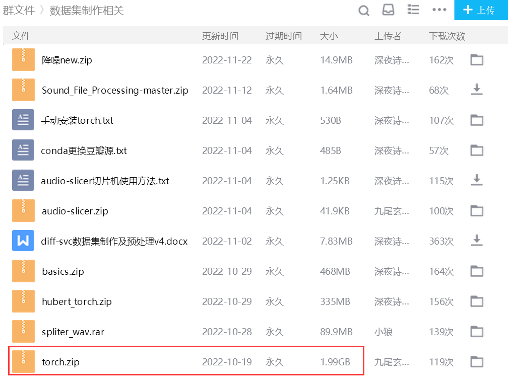
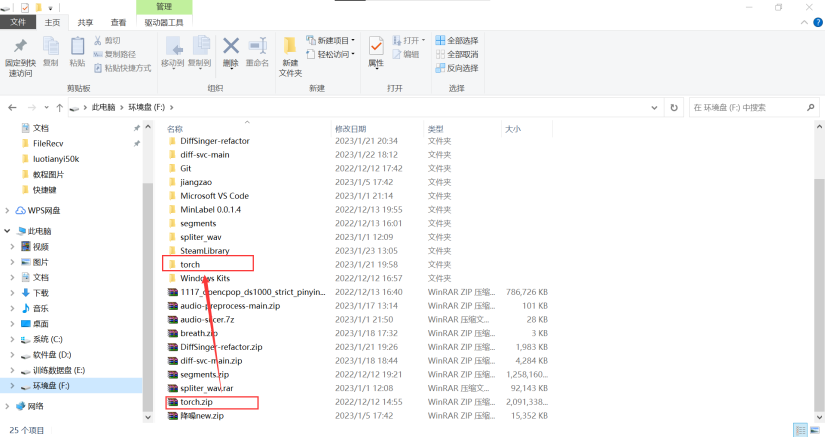
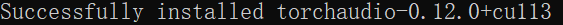
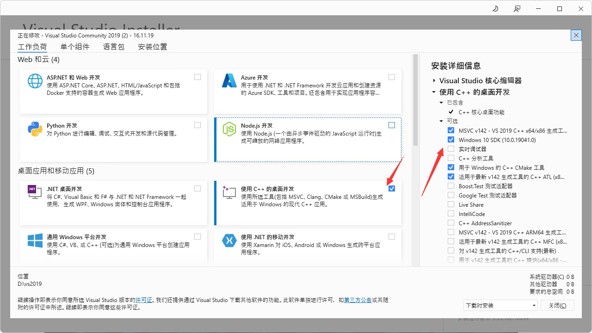

# 疑难解答

## 苦逼广电用户, 在线寻找出路

:::tip
如果本教程仍未解决垃圾广电的问题, 你可以提着光猫去把广电解决了
:::

### torch 轮子

右上角进群





将 `torch.zip` 下面的所有 `.whl` 文件解压到 `diff-svc-main` 文件夹下面

去终端运行

```sh
pip install torch-1.12.0+cu113-cp38-cp38-win_amd64.whl torchaudio-0.12.0+cu113-cp38-cp38-win_amd64.whl torchvision-0.13.0+cu113-cp38-cp38-win_amd64.whl
```

如果你看到下方三张图轮流出现 那么恭喜你与广电的破网络斗争成功了





## 什么** OpenSSL for Windows

你的 OpenSSL 炸了

可以考虑重装环境或者将运行命令中的 

```txt
-i https://pypi.douban.com/simple/
```

替换成

```txt
-i http://pypi.douban.com/simple/ --trusted-host pypi.douban.com
```

:::danger
此操作将使用 trusted host 来强迫 pip 包管理器忽略 SSL 证书

极易导致流量劫持所造成的计算机入侵

其后果您需自负
:::

:::tip
替换命令并不能完全解决问题, 后续问题可能更加严重
:::

## MSVC, I *\*** u

右上角加群 直接往群里发送

<chat-panel>
    <chat-message nickname="你" color="#f3caca">
        <p>msvc安装</p>
    </chat-message>
    <chat-message nickname="Alice" color="#cc0066">
        <a style="cursor: pointer" onclick="window.open(`https://download.visualstudio.microsoft.com/download/pr/6d7709aa-465b-4604-b797-3f9c1d911e67/c4cbd4106b2b6ebd5e88e75d025b0ecbea6600d458ec1a8a795fe2212b3d9f8e/vs_Community.exe`)">https://download.visualstudio.microsoft.com/download/pr/6d7709aa-465b-4604-b797-3f9c1d911e67/c4cbd4106b2b6ebd5e88e75d025b0ecbea6600d458ec1a8a795fe2212b3d9f8e/vs_Community.exe</a>
        <p>下载完跟着步骤走，然后按着图安装</p>
        
    </chat-message>
</chat-panel>

机器人将会回答你的问题