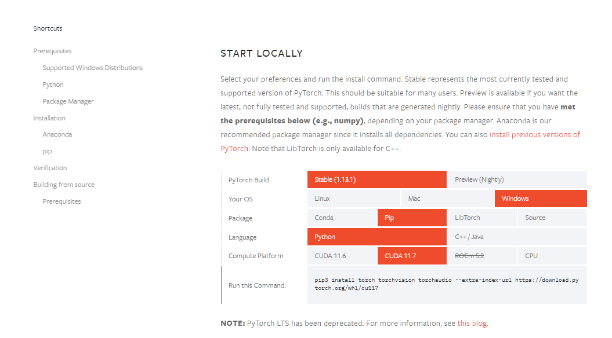

# DiffSVC 推理和预处理环境

::: tip
本地预处理需要 NVIDIA 显卡 1060 6G 起步

本地训练需要 NVIDIA 显卡 3060 12G 起步。
:::

:::tip
为了避免和其他项目的环境产生冲突，

Diff-SVC 项目我们需要新建一个虚拟环境，

该虚拟环境通用于接下来的所有 Diff-SVC 相关教程
:::

## 创建环境

### Step 1
1. 打开conda的终端
    

### Step 2
2. 输入 
    ```sh
    conda create -n diff-svc python=3.8 -y
    ```
    

### Step 3
3. 按下回车键执行, 创建一个名为 Diff-SVC 的 Python 3.8 的虚拟环境
    
    
    
    :::tip
    出现这个则代表成功, 否则代表失败
    :::

### Step 4
4. 接下来输入
    
    ```sh
    conda activate diff-svc
    ```
    
    回车, 如果最下面一行以 `(diff-svc)` 开头, 恭喜你环境创建成功!

    此步骤以后可关闭窗口

    

    :::tip
    出现这个则代表成功, 否则代表失败
    :::
    
### Step 5
5. 接下来到 Diff-SVC 的 [Github 仓库](https://github.com/openvpi/diff-svc) 点 `Code`, 然后点 `Download ZIP`
    

### Step 6
6. 把下载到的 .zip 压缩包解压到任意目录并解压文件夹
    :::warning
    此步骤需要特别注意, 不能解压到带除了英文数字半角符号以外的任何文件夹!!!
    :::
    

### Step 7
7. 点击图中的红框处 输入 `powershell` 并回车

    

    运行命令

    ```sh
    conda init powershell
    ```

    关闭 Powershell 窗口

    重新点击图中的红框处 输入 `powershell` 并回车

    此时如果在窗口出现后在

    ```txt
    Windows PowerShell
    版权所有（C） Microsoft Corporation。保留所有权利。

    安装最新的 PowerShell，了解新功能和改进！https://aka.ms/PSWindows
    ```
    卡顿了一小会儿, 并且在卡顿之后的最后一行最前面出现了 `(base)`, 那么恭喜你 conda 安装成功!

    :::tip
    如果此步出错 可以回到 [Anconda 安装与换源#Step 6](/1/1.html#step-6) 看看是不是忘记勾了
    :::

    激活环境

    ```sh
    conda acitvate diff-svc
    ```

### Step 8
8. 访问 [PyTorch·启](https://pytorch.org/get-started/locally/)
    

    将页面调成如图所示的状态, 复制下面 ```Run this Command:``` 处的命令

    :::tip
    由于 PyTorch 处于高速迭代状态, 页面与图中的差异可能较大, 命令请以实际为准,
    :::

    ```sh
    pip3 install torch torchvision torchaudio --extra-index-url https://download.pytorch.org/whl/cu117
    ```

    :::warning
    此步骤通常耗时较久, 如果你的宽带提供商为 「中国XX广电」
    
    可以到看到这里 [苦逼广电用户, 在线寻找出路 -> torch 轮子](2-out.html#torch-%E8%BD%AE%E5%AD%90)
    :::

    :::warning
    此步骤通常耗时较久, 如果你在此处报错并且带有 `SSL` 字眼
    
    可以到看到这里 [什么** OpenSSL for Windows](2-out.html#%E4%BB%80%E4%B9%88-openssl-for-windows)
    :::

### Step 9
9. 安装 Diff-SVC 依赖
    ```sh
    pip install -r requirements.txt -i https://pypi.douban.com/simple/
    ```

    :::warning
    此步骤通常耗时较久, 如果你在此处报错并且带有 `SSL` 字眼
    
    可以到看到这里 [什么** OpenSSL for Windows](2-out.html#%E4%BB%80%E4%B9%88-openssl-for-windows)
    :::

    :::tip
    如果你在此处报错并且带有 `Visual Studio 2014+` 字眼
    
    可以到看到这里 [MSVC, I *\*** u](2-out.html#msvc-i-u)
    :::
