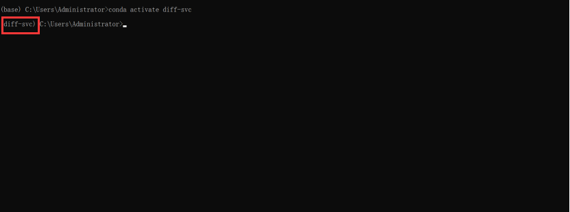

# DiffSVC 推理和预处理环境

::: tip
本地预处理需要 NVIDIA 显卡 1060 6G 起步

本地训练需要 NVIDIA 显卡 3060 12G 起步。
:::

:::tip
为了避免和其他项目的环境产生冲突，

Diff-SVC 项目我们需要新建一个虚拟环境，

该虚拟环境通用于接下来的所有 Diff-SVC 相关教程
:::

## 创建环境

1. 打开conda的终端
    

2. 输入 
    ```sh
    conda create -n diff-svc python=3.8 -y
    ```
    

3. 按下回车键执行, 创建一个名为 Diff-SVC 的 Python 3.8 的虚拟环境
    
    :::tip
    出现这个则代表成功, 否则代表失败
    :::

4. 接下来输入
    ```sh
    conda activate diff-svc
    ```
    
    :::tip
    出现这个则代表成功, 否则代表失败
    :::
    
5. 接下来到 Diff-SVC 的 [Github 仓库](https://github.com/openvpi/diff-svc) 点 `Code`, 然后点 `Download ZIP`
    

6. 把下载到的 .zip 压缩包解压到任意目录并解压文件夹
    :::warning
    此步骤需要特别注意, 不能解压到带除了英文数字半角符号以外的任何文件夹!!!
    :::
    

7. 点击图中的红框处 输入 `powershell` 并回车

    

    运行命令

    ```sh
    conda init powershell
    ```

    关闭 Powershell 窗口

    重新点击图中的红框处 输入 `powershell` 并回车

    此时如果在窗口出现后在

    ```txt
    Windows PowerShell
    版权所有（C） Microsoft Corporation。保留所有权利。

    安装最新的 PowerShell，了解新功能和改进！https://aka.ms/PSWindows
    ```
    卡顿了一小会儿, 并且在卡顿之后的最后一行最前面出现了 `(base)`, 那么恭喜你 conda 安装成功!

    :::tip
    
    :::