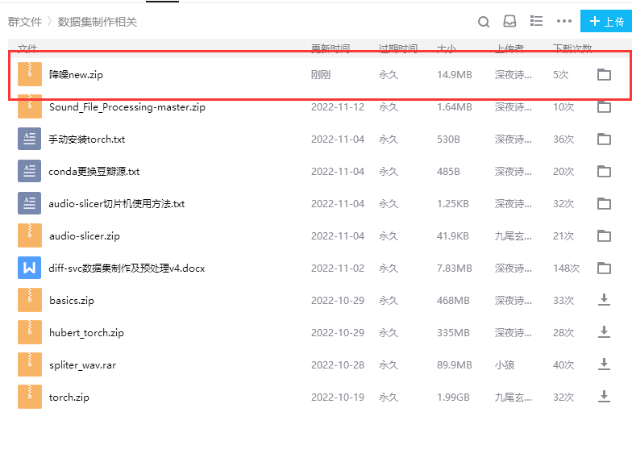
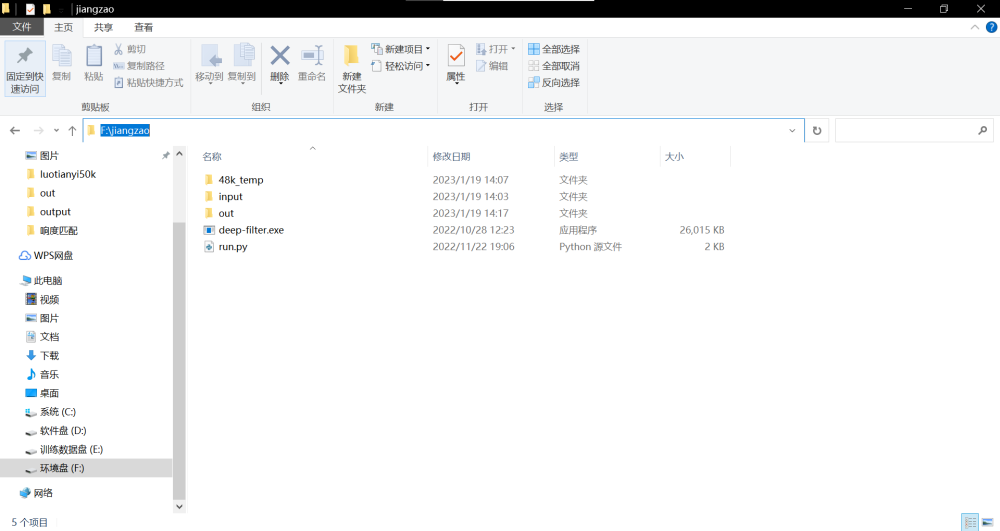

# 数据集整理与制作

:::tip
我们推荐各位对高质量音声授权素材进行训练，实际训练中请注意素材来源的版权问题
:::

## 本次教程使用的文件以及程序下载途径一览

|    名称        |                      途径                  |
|----------------|------------------------------------------ |
| Audio-SlicerUI | https://github.com/flutydeer/audio-slicer |
|      降噪      |                群文件 `降噪.zip`           |
|    响度匹配     |              自行寻找资源                  |
|     Diff-SVC   |       https://github.com/openvpi/diff-svc |

## 降噪 

:::warning
降噪必须一次处理完所有需要处理的文件
:::

:::tip
群里提供的 dfn 降噪脚本可能会影响数据高频，若对数据集质量有要求，请自主百度其它降噪方法
:::

部分降噪方法推荐:

| 名称 | 链接 |
| - | - |
|AU 降噪 | https://zhuanlan.zhihu.com/p/243260884|
|RX8 降噪 | https://www.bilibili.com/video/BV1g34y1q748|

## 开始

:::tip
本教程默认你已经看过 [上一篇](/1/) 教程，并且继承了上一篇教程的状态

此时你的终端应该以 `(diff-svc)` 开头而不是 `(base)`

如果你不小心退出了终端，请阅读 [DiffSVC 推理和预处理环境 #Step 8](/1/2.html#step-8) 进入环境 
:::

### Step 1
1. 下载群文件数据集制作相关文件夹里的 `降噪 new.zip`

    

### Step 2
2. 将其解压到 `diff-svc-main/jiangzao` ( jiangzao 文件夹不存在，需要自行创建) 里面

    解压完成后 `diff-svc-main/jiangzao` 长这样

    

### Step 3
3. 回到终端 执行命令
    ```sh
    cd jiangzao
    pip install numpy --upgrade -i https://pypi.douban.com/simple/ 
    pip install soundfile -i https://pypi.douban.com/simple/
    ```
    :::warning
    此步骤通常耗时较久，如果你在此处报错并且带有 `SSL` 字眼
    
    可以到看到这里 [什么 ** OpenSSL for Windows](../1/2-out.html#% E4% BB%80% E4% B9%88-openssl-for-windows)
    :::

    :::tip
    如果你在此处报错并且带有 `Visual Studio 2014+` 字眼
    
    可以到看到这里 [MSVC, I *\*** u](../1/2-out.html#msvc-i-u)
    :::

### Step 4
4. 在 `diff-svc-main/jiangzao` 目录下新建一个 `input` 目录，存放 `.wav` 格式的音频文件
    :::tip
    一定要是 `.wav` 格式的，如果不是请自行寻找格式转换软件及网站
    :::

    :::warning
    所有音频建议只用英文或者数字进行命名

    降噪不支持 24bit 的音频文件，请转换成 16bit
    :::

### Step 5
5. 运行命令
    ```sh
    python run.py
    ```
# 待更