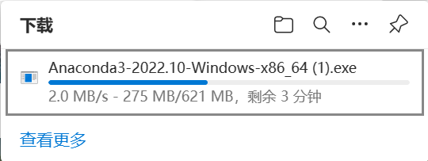
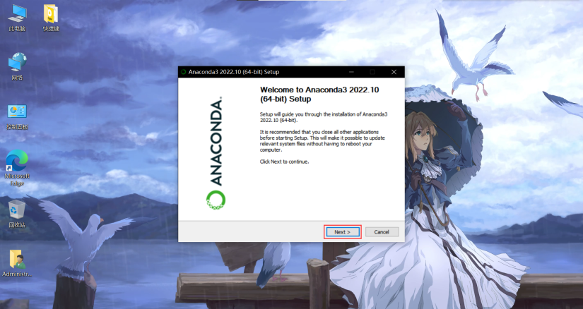
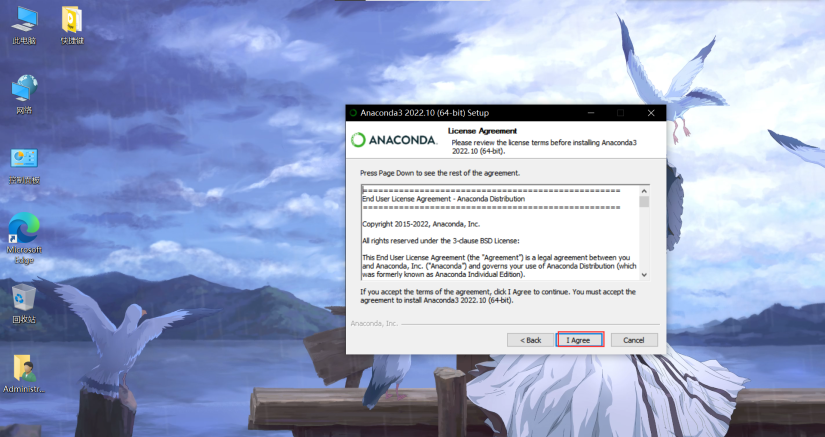
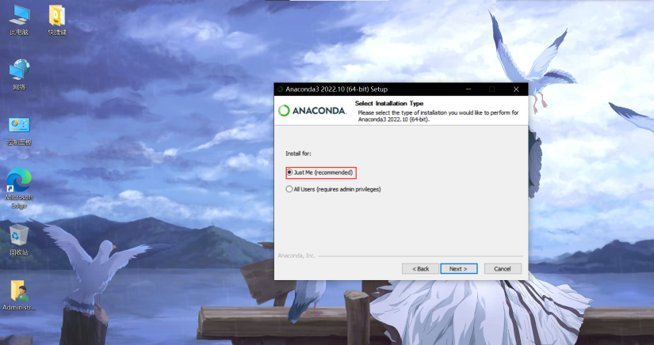
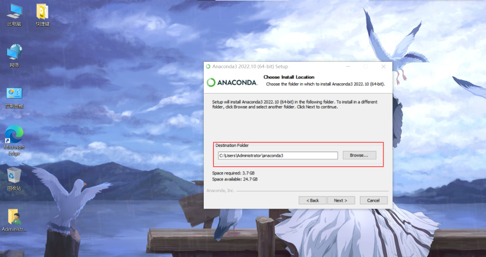
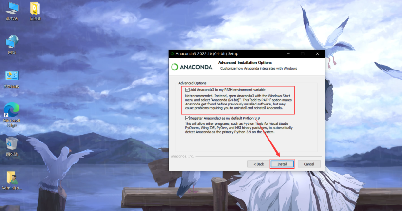
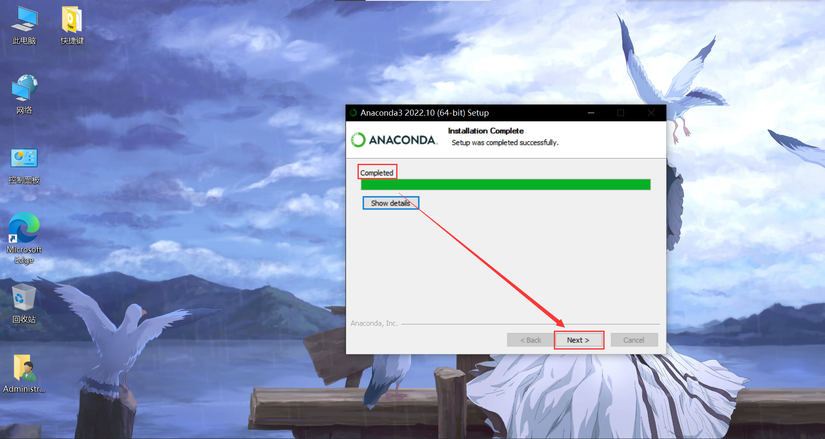

# Anconda 安装与换源

## 下载并安装 Anaconda

[点击此处](https://mirrors.bfsu.edu.cn/anaconda/archive/Anaconda3-2022.10-Windows-x86_64.exe)，下载 Windows X64 版本 Anaconda

:::tip
此步骤耗时因网络原因可能较长
:::

### Step 1
1. 请将其放在你舒适的工作平面上并双击启动
    

### Step 2
2. 点击 `Next`
    

### Step 3
3. 点击 `I agree`
    

### Step 4
4. 点击 `Just me`
    

### Step 5
5. 默认安装在 `C` 盘, 空间不足可安装到 `D` 盘
    :::warning
    此步骤需要特别注意, 不能安装到带除了英文数字半角符号以外的任何文件夹!!!
    :::
    

### Step 6
6. 请务必选择 **`add path`**!
    

### Step 7
7. 点击 `Install` 并耐心等待下载完成
    

### Step 8
8. 下载完成，点击 `Next` 退出